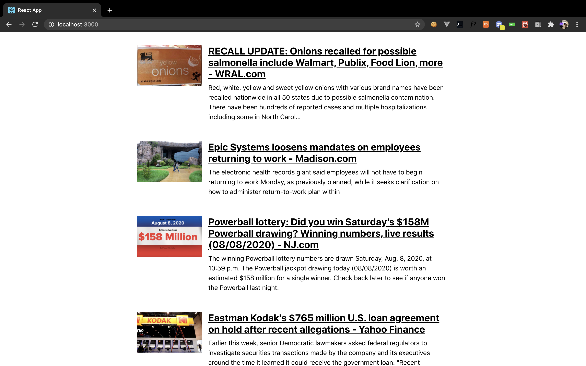

# React News API

React.js 외부 API를 연결하는 방법을 공부하기 위해서 프로젝트입니다.  
Styled, axios를 사용하였습니다.

```shell
npm install
npm start
```
위에 명령어를 사용해 주세요.

[참고한 블로그 포스팅](https://velog.io/@gandalfzzing/React.%EC%99%B8%EB%B6%80API%EC%97%B0%EB%8F%99%ED%95%98%EA%B8%B0NewsAPI)



[News API](https://newsapi.org/)를 사용하였습니다.